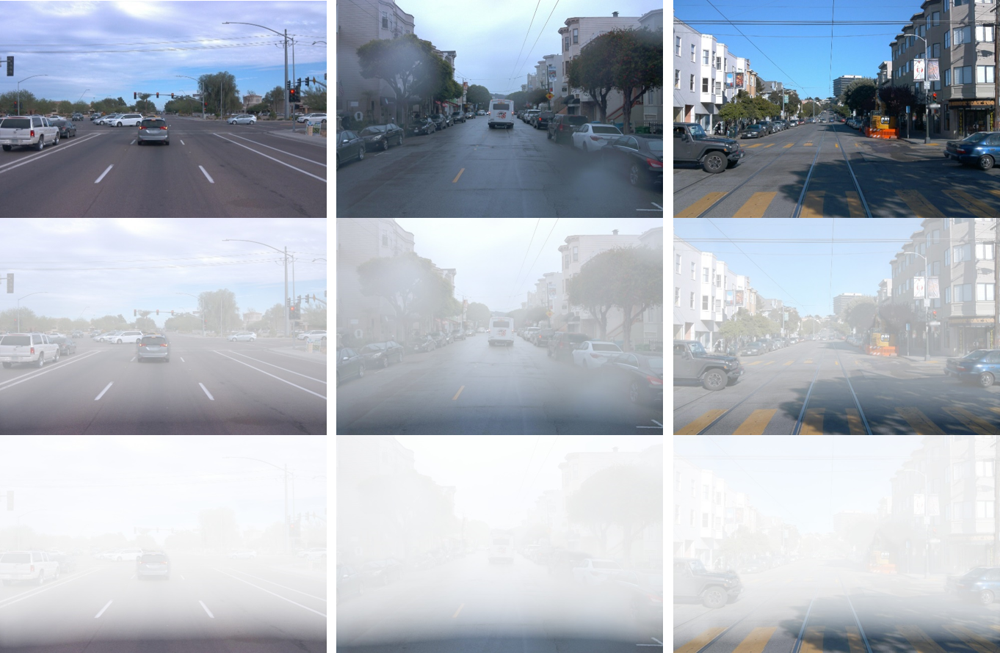

# Synthesize Hazy/Foggy Image using Monodepth and Atmospheric Scattering Model

### Dependencies
- OpenCV
- Matplotlib
- Numpy

### How to Use

#### 1. Generate Depth Map
- An easy-to-use implementation of Generate Depth map by: https://github.com/hoangth55/depthmap

#### 2. Locate Image Files (optional)
- Put the original (clean) image in the folder "docs"
- Put the generated depth map in the folder "docs"
- Say "fname" is the file name of the clean image, the file name of the generated depth map should be "fname_depth"


#### 3. Setup & Generate Hazy Image
conda create -n haze pip python=3.7
conda activate haze
pip install opencv-python==3.4.2.17
conda install -c conda-forge matplotlib
conda install -c anaconda pillow

Run: python synthesize-haze.py

### Results
- 1st row: original images
- 2nd row: synthesized hazy images with sparse haze
- 3rd row: synthesized hazy images with dense haze


### Citation
```
H2T
Aug. 2023
